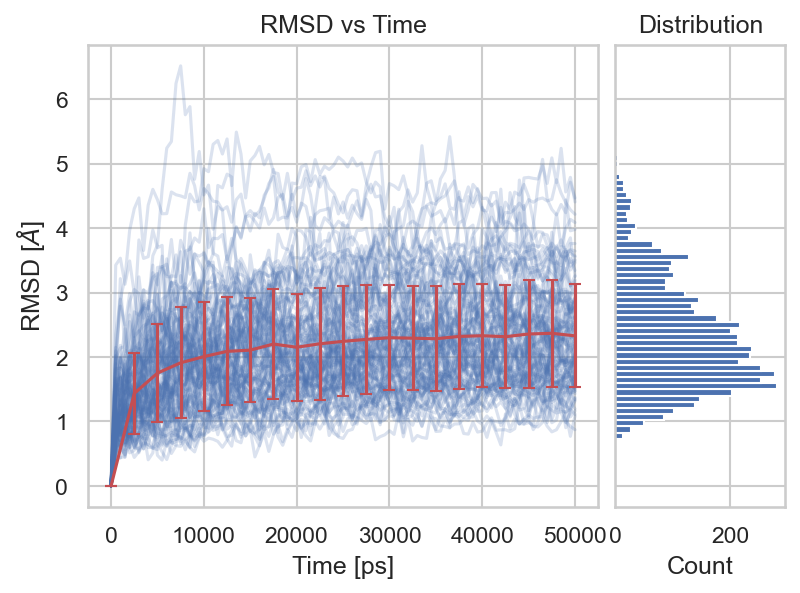

# basic-md-analysis

## Project Overview

This project analyzes an all-atom molecular dynamics simulation of short peptides in explicit solvent using Python-based tools (MDAnalysis, NumPy, Matplotlib). It extracts structural and dynamic properties such as RMSD, radius of gyration, intermolecular contacts, and diffusion. The goal is to showcase molecular simulation analysis using data science workflows and build an open-source example of MD-based feature extraction.

## Objectives

- Parse and clean raw simulation data using **Python**
- Explore trends in energy, temperature, or other observables
- Visualize time series and statistical distributions
- Automate parts of the analysis with custom scripts

## 🌟 Highlights
- Visualization of peptide trajectory movement (XYZ displacement) (notebooks/reading_trj.ipynb)
- RMSD and radius of gyration evolution over time (notebooks/rmsd_gyration.ipynb)
- Planned: residue contacts, density profiles, ML clustering

## Tools & Libraries

- `numpy`
- `matplotlib`
- `seaborn`
- `MDAnalysis`

## Folder Structure

<pre>
basic-md-analysis/
├── README.md
├── requirements.txt
│
├── data/                    # raw and processed data                 
│
├── notebooks/               # main analysis file
│   ├── reading_trj.ipynb
│   ├── rmsd_gyration.ipynb
│   ├── contacts.ipynb       # next to add
│   ├── density.ipynb        # next to add
│   └── clustering.ipynb     # next to add + scikit-learn
│
├── scripts/
│   └── __init__.py
│   └── helper.py            # python scripts for analysis and preprocessing
│
└── figures/                 # exported plots
    ├── rmsd.png
    ├── gyration.png
</pre>

## Example Visualizations

## How to Run

1. Clone the repository:

   git clone https://github.com/yourusername/basic-md-analysis.git
   
   cd basic-md-analysis

3. Create and activate a virtual environment (optional):

   python -m md-env md-env
   
   source md-env/bin/activate  # or md-env\Scripts\activate on Windows

4. Install dependencies:

   pip install -r requirements.txt

5. Open the notebook:

   jupyter notebook notebooks/analysis.ipynb

   ## Status

This is a personal project intended to practice data science techniques using scientific data. Future improvements may include:
- Interactive dashboard (e.g. Dash/Plotly)
- Integration with machine learning models
- More advanced simulation parsing tools

